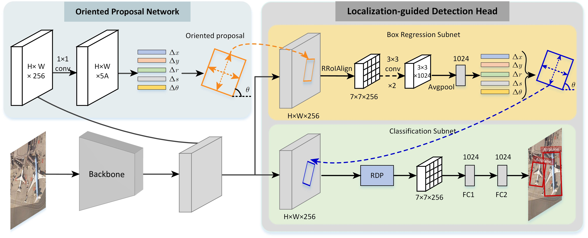

# [Dual Alignment for Oriented Object Detection](https://arxiv.org/)

Gong Cheng, Yanqing Yao, Shengyang Li, Ke Li, Xingxing Xie, Jiabao Wang, Xiwen Yao and Junwei Han

## Introduction



In the past few years, object detection in remote sensing images has achieved remarkable progress. However, the detection results of those oriented and densely packed objects are still unsatisfactory due to the following spatial and feature misalignments. i) Most two-stage oriented detectors only introduce an orientation regression branch in the detection head, while still leverage horizontal proposals for classification and regression. This inevitably results in the spatial misalignment between horizontal proposals and oriented objects. ii) The features used for classification are extracted by coarse candidate proposals which have biases from the final predictions. This leads to the feature misalignment between the classification and the localization tasks. In this paper, we present a two-stage oriented object detection method, termed Dual-aligned Oriented Detector (DODet), towards evading the aforementioned spatial and feature misalignments. In DODet, the first stage is an Oriented Proposal Network (OPN), which generates high-quality oriented proposals via a novel representation scheme of oriented objects. The second stage is Localization-guided Detection Head (LDH) that aims at alleviating the feature misalignment between classification and localization. Comprehensive and extensive evaluations on three benchmarks, i.e., DIOR-R, DOTA, and HRSC2016, indicate that our method could obtain consistent and substantial gains compared with the baseline method.

## Installation

### Test Platform
- Ubuntu1804 + Anaconda
- GCC 7.5.0
- CUDA 10.2
- Python 3.9.7
- pytorch 1.9.1
- torchvision 0.10.1
- mmdet 2.2.0
- mmcv  0.6.2

a. install CUDA, Python and pytorch with conda. [official instructions](https://pytorch.org/)

``` shell
conda create -n dodet
conda activate dodet
conda install python=3.9.7 pytorch=1.9.1 torchvision=0.10.1 cudatoolkit=10.2 -c pytorch
```

b. clone modified mmdet code and install mmcv.

``` shell
git clone https://github.com/yanqingyao1994/DODet
cd DODet
pip install -r requirements.txt
pip install pycocotools
pip install mmcv==0.6.2
pip install -v -e .
cd BboxToolkit
pip install -v -e .
```

## Get Started

### Dataset Preparation

Get DOTA Dataset from [Online](https://captain-whu.github.io/DOTA/dataset.html), and extract them to the DOTA directory.

``` shell
cd ..

# tree data -L 2
# data
# ├── test
# │   └── images
# ├── train
# │   ├── images
# │   └── labelTxt
# └── val
#     ├── images
#     └── labelTxt

python BboxToolkit/tools/img_split.py --base_json BboxToolkit/tools/configs/ss_dota_train.json
python BboxToolkit/tools/img_split.py --base_json BboxToolkit/tools/configs/ss_dota_val.json
python BboxToolkit/tools/img_split.py --base_json BboxToolkit/tools/configs/ss_dota_test.json

# optional
python BboxToolkit/tools/img_split.py --base_json BboxToolkit/tools/configs/ss_dota_trainval.json
```

### Training

``` shell
# one GPU training
python tools/train.py configs/dodet.py

# multiple GPUs traing
python /tools/dist_train.sh configs/dodet.py ${GPU_NUM}
```

### Test

``` shell
# single-gpu testing
python tools/test.py configs/dodet.py ${CHECKPOINT_FILE} [--out ${RESULT_FILE}] [--eval ${EVAL_METRICS}] [--show]

# multi-gpu testing
python tools/dist_test.sh configs/dodet.py ${CHECKPOINT_FILE} ${GPU_NUM} [--out ${RESULT_FILE}] [--eval ${EVAL_METRICS}]

# merge detection results
python tools/test.py configs/dodet.py ${CHECKPOINT_FILE} --format-only --options save_dir=${SAVE_DIR}
```

### Benchmark

| Model | Backbone | Dataset | Lr schd |  mAP |
|:-:|:-:|:-:|:-:|:-:|
| DODet | R50-FPN | DIOR-R |1x  | 65.10 |
| DODet | R50-FPN | DOTA1.0 | 1x  | 75.49 |
| DODet | R101-FPN | DOTA1.0 | 1x  | 75.89 |

## Citation
This code is based on MMdetection2[https://github.com/open-mmlab/mmdetection], and the core part of this code is modified from OBBDetection[https://github.com/jbwang1997/OBBDetection].

If you use this repo in your research, please cite the following information.

```
@unpublished{DODet,
   author = "Cheng, Gong and Yao, Yanqing and Li, Shengyang and Li, ke and Xie, Xingxing and Wang, Jiabao and Yao, Xiwen and Han, Junwei",
   title = "Dual alignment for oriented object detection",
}

@article{li2020object,
  title={Object detection in optical remote sensing images: A survey and a new benchmark},
  author={Li, Ke and Wan, Gang and Cheng, Gong and Meng, Liqiu and Han, Junwei},
  journal={ISPRS Journal of Photogrammetry and Remote Sensing},
  volume={159},
  pages={296--307},
  year={2020},
  publisher={Elsevier}
}

@misc{cheng2021,
  title={Anchor-free Oriented Proposal Generator for Object Detection}, 
  author={Cheng, Gong and Wang, Jiabao and Li, Ke and Xie, Xingxing and Lang, Chunbo and Yao, Yanqing and Han, Junwei},
  year={2021},
  eprint={2110.01931},
  archivePrefix={arXiv},
  primaryClass={cs.CV}
}
```

## Contact

If you have any question, please email to eyao468@gmail.com.
